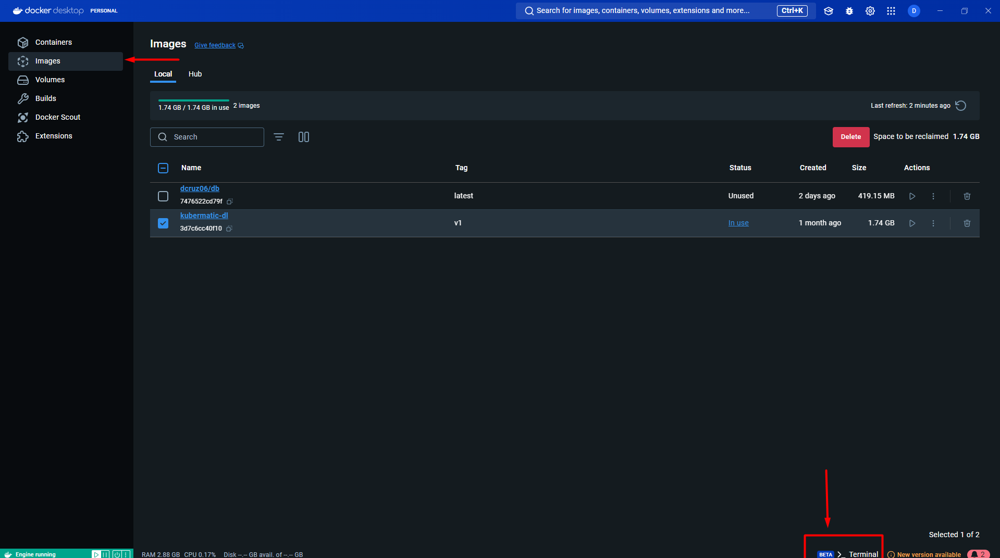

# Aplicación de productos
Se realiza una aplicación de productos sencilla para la demostración cercana de una app en producción.

 Si no tiene docker puede visitar la siguiente página para su instalación:
--
**Instalar Docker Server**  [dockerDocs](https://docs.docker.com/engine/install/)

**Instalar Docker Desktop** [DockerDocsDesktop](https://docs.docker.com/desktop/)

# Despliegue de la app

 Despliegue de images y contenedores
--
1. Opción uno, desplegar por Docker CLI
    1. Descargar el árbol de todas las carpetas, debes tener la siguiente estructura:
    
        

    2. **Desplegar contenedores:** Dentro de las carpetas **Frontend**, **Backend** y **db** se encuentran dos archivos llamados ```Dockerfile``` y ```requirements.txt``` los cuales permitiran la construcción y el despliegue de los microservicios
    
        

        * **Desplegar usando Docker**: ```docker build -t nombreUsuario/nombreImagen:versionName .``` o sin usuario ```docker build -t nombreImagen .```
        * **Correr:** ```docker run -d -p port:port nombreUsuario/nombreImagen:versionName```

        Ejemplo de despliegue: ```docker run -d -p 4200:4200 dcruz06/frontend:latest```

        Nota: Los puertos asignados para este proyecto fueron: [
             **Frontend:** 4200,
             **Backend:**  5001,
             **Databases:** 5432
        ]
        
        
        
        Si deseo ver el log de lo que esta pasando con el contenedor puedo hacer uso del comando ```docker logs <NOMBRE_CONTENEDOR_O_ID_CONTENEDOR>```

        

    3. **Desplegar demás microservicios:**
        Debes seguir cada uno de los pasos anteriores con cada carpeta **Frontend**, **Backend** y **db** al final debe quedarte similar a la siguiente imagen:
        
        **Images:**

        

        **Containers:**

        

        **Nota:** Recuerda exponer adecuadamente cada puerto

2. **Desplegar por dashboard de escritorio:**
    1. Debes ingresar al aplicativo de escritorio y desde la pestaña de Images desplegar el terminal:
    
            

    2. Escribir en la terminal los siguientes comandos para descargar las imagenes de un repositorio en DockerHub:

        * ```docker pull dcruz06/frontend:latest```
        * ```docker pull dcruz06/backend:latest```
        * ```docker pull dcruz06/db:latest```

        

        Se permitiran visualizar las imagenes y contenedores que tiene el ordenador:
        
        

 Despliegue en Kubernetes
--
#  Para crear un cluster con AKS
Lo primero que se debe hacer es activiar el microsoft.provider, que se encuentra en la siguiente ruta

   

# Seguido debemos buscar AKS services
Para eso vamos usar la barra de busqueda y escribir AKS, apareceran las siguientes opciones

   

Seleccionamos la opción que dice services

# Crear cluster
Al ingresar al servicio vamos a seleccionar la opción de crear:


Se debe crear un grupo en caso que no exista, esto con el fin de referenciar y trabajar todos los complementos dentro del mismo grupo


En el apartado de Clusters Details/  Cluster preset configuration, se debe seleccionar el objetivo del cluster con el fin de tener un mejor performance 
Para este caso se uso la primer opción resaltada con el recuadro rojo.

   

En este apartado se debe dar un nombre al cluster, en este caso se le asigna AKS-EP2-CNUBE, 
Seguido debemos seleccionar la región en la que se desea crear el cluster, en el caso puntual como no deseamos tener tantos recursos del cluster
Seleccionamos una región con poco trafico, al mismo tiempo se debe tener en cuenta la configuración de los nodos, es decir de los recursos del cluster.


Para la configuración de los nodos seleccionamos la región de Australia pues fue una de las conbinaciones que permitio los siguientes recursos:


Para el apartado de monitoring:
Se dan las siguientes opciones disponibles:


Tags, este apartado te permite generar un tag para un grupo determinado siempre y cuando ya se encuentre creado, de lo contrario se puede dejar por defecto en blanco


Preview + Create. En este último paso se realiza un check de que todos los ítems se encuentren correctamente configurados antes de crear el cluster, seleccionar ```'Review + Create'```


--

Deployment usando ```kubectl```
---
Primero debemos dar clic en 'Connect'.


Y saldra el siguiente recuadro para conectar por diferentes medios


En este caso se va a conectar usando el CLI de azure, se copian los comandos para ingresar al cluster como se muestra en la siguiente imagen:


Una vez dentro del cluster debera aparecer una mensaje como este para confirmar el ingreso:


Deployment
--
Para este punto se debe tener los archivos manifiestos de kubernetes ```.yaml``` que se encuentran en este repositorio, se debe desplegar en el siguiente orden. Los archivos los puedes descargar directamente del repositorio con un git clone o en .zip y cargadlos a la nube usando la opción de **'Manage Files'**:


    1. Carpeta DB (Aplicar en el siguiente orden):
        *   deployment-db.yaml
        *   persistanVolumenClaim.yaml
        *   service-db.yaml
aplicar comando ```kubectl get all -n myapp-namespace``` para extraer el external ip que es el que debe ir en el url de conexión en el servicio backend
    


    2. Modificar URL obtenida en el external ID del servicio de db en app.py de la cerpeta qpp.py


    3. Desplegar sitio en docker hub para ello es necesario que se aplique nuevamente el comando 'docker build -d -p 5001:5001 dcruz06/webapp:latest .' 
    Seguido del comando 'docker push dcruz06/webapp:latest'. Esto para que el sitio quede dockerizado y cargado en el hub para posteriormente ser desplegado en kubernetes
